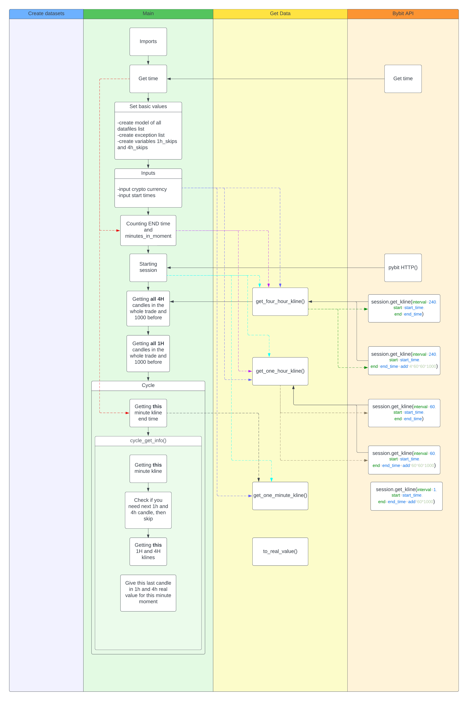

# CryptoChartDataCollector
Crypto chart data collector:
This is program created by me, that uses bybit api to get data for some cryptocurrenncy. This program is meant to be used as data collector for machine learning for crypto futures trading. Program analyses deals you have made and creates data. 
## How it works:
- You enter required symbol, that you've made deal on
- You enter what deal have you made(Bought, Sold or you can tell that you was waiting and did nothing(to train ai))
- Than you enter time, when you've entered the deal
- And of course time when you closed it(your position)
## How program analysis data:
Here you can see part of descripted code:
- create_data.py is the main file that you should launch to run the programm
- collect_data_lib_V5.py is file where contains project API connection and data collection logic
- create_datasets_V5.py is file used to convert data in arrays to padas datasets, that then are converted in csvs
  

